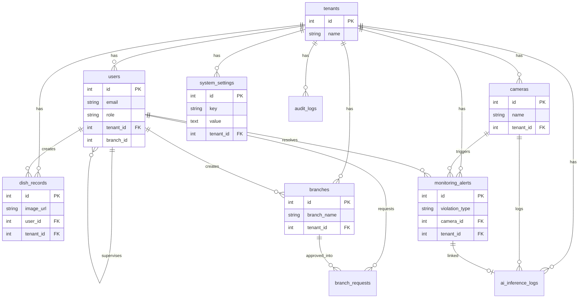

# معمارية قاعدة البيانات — منصة عين الجودة

> **DATABASE_ARCHITECTURE_AR.md**  
> الإصدار: 1.0 · يونيو 2026 · نتيجة تدقيق كامل للكود والمخطط الحي  
> المحرك الإنتاجي: **PostgreSQL** · التطوير المحلي: **SQLite** (`sqlite:///./test.db`)

---

## جدول المحتويات

1. [ملخص التدقيق](#1-ملخص-التدقيق)
2. [حالة الهجرة](#2-حالة-الهجرة)
3. [أين تُخزَّن البيانات الحرجة؟](#3-أين-تُخزَّن-البيانات-الحرجة)
4. [مصفوفة الميزات → الجداول](#4-مصفوفة-الميزات--الجداول)
5. [جداول PostgreSQL النشطة (12)](#5-جداول-postgresql-النشطة-12)
6. [مخطط ER (علاقات الكيانات)](#6-مخطط-er-علاقات-الكيانات)
7. [تخزين خارج PostgreSQL](#7-تخزين-خارج-postgresql)
8. [نتائج فحص Excel / CSV / JSON / SQLite](#8-نتائج-فحص-excel--csv--json--sqlite)
9. [مسارات API الرئيسية لكل جدول](#9-مسارات-api-الرئيسية-لكل-جدول)
10. [توصيات v2](#10-توصيات-v2)
11. [قائمة فحص التدقيق](#11-قائمة-فحص-التدقيق)

---

## 1. ملخص التدقيق

| البند | النتيجة |
|-------|---------|
| عدد جداول SQLAlchemy النشطة | **12** |
| محرك الإنتاج (Render) | **PostgreSQL** عبر `DATABASE_URL` |
| محرك التطوير المحلي | SQLite (`backend/.env` → `sqlite:///./test.db`) |
| Excel كقاعدة بيانات | **لا** — تصدير فقط (`.xlsx` يُولَّد من بيانات API) |
| CSV كقاعدة بيانات | **لا** — أُزيل من الواجهة؛ بقايا اسم ملف في helper قديم |
| JSON كتخزين دائم للأعمال | **لا** — JSON داخل أعمدة PostgreSQL (`system_settings.value`, `audit_logs.metadata_json`) |
| SQLite في الإنتاج | **لا** — محلي فقط |
| بيانات أعمال حرجة خارج PG | **جزئياً** — انظر [§7](#7-تخزين-خارج-postgresql) |

**الخلاصة:** جميع الكيانات التجارية الأساسية (مستخدمون، فروع، كاميرات API، مخالفات، أطباق، إعدادات، تدقيق) في **PostgreSQL**. يوجد تخزين مؤقت/مساعد في المتصفح (`localStorage`) وملفات وسائط على القرص.

---

## 2. حالة الهجرة

### الحكم: **مُهاجَر جزئياً (Partially migrated) — ~92%**

| الفئة | الحالة |
|-------|--------|
| مستخدمون، فروع، مخالفات، أطباق، كاميرات (API) | ✅ 100% PostgreSQL |
| إعدادات الإدارة (canonical) | ✅ PostgreSQL (`system_settings`) + cache محلي |
| سجلات التدقيق والذكاء الاصطناعي | ✅ PostgreSQL |
| صور الأطباق (ملفات) | ⚠️ ملفات على القرص + metadata في `dish_records` |
| إعدادات مناطق الكاميرا (3 zones) | ⚠️ `localStorage` مؤقت — API جاهز |
| نماذج YOLO | ⚠️ ملفات `.pt` على القرص / HuggingFace (ليس بيانات أعمال) |
| Excel / PDF / تقارير | ✅ تُولَّد عند الطلب من PostgreSQL — ليست قاعدة بيانات |

**للوصول إلى 100%:** نقل `ska_restaurant_camera_configs_v1` من `localStorage` إلى جدول `cameras` عبر `/api/v1/supervisor/cameras` (مهمة frontend v2).

---

## 3. أين تُخزَّن البيانات الحرجة؟

| نوع البيانات | التخزين الأساسي | الجدول / المسار | ملاحظات |
|--------------|-----------------|-----------------|---------|
| **بيانات المستخدمين** | PostgreSQL | `users` (+ `tenants`) | كلمة المرور مُجزَّأة (bcrypt) في `users.password` |
| **بيانات الفروع** | PostgreSQL | `branches` | القائمة الرسمية للفروع النشطة |
| **طلبات فروع جديدة** | PostgreSQL | `branch_requests` | موافقة المدير |
| **بيانات الكاميرات (API)** | PostgreSQL | `cameras` | `stream_url` مشفّر (`enc:v1:`) |
| **إعدادات كاميرا المناطق (UI)** | `localStorage` مؤقت | `ska_restaurant_camera_configs_v1` | يُفضَّل الاعتماد على `cameras` |
| **المخالفات / التنبيهات** | PostgreSQL | `monitoring_alerts` | لا يوجد جدول `violations` منفصل |
| **سجلات الأطباق** | PostgreSQL | `dish_records` | metadata الصورة في `image_url` |
| **ملفات صور الأطباق** | قرص السيرفر | `backend/media/dishes/` | المسار عبر `DISH_MEDIA_DIR` |
| **إعدادات النظام** | PostgreSQL | `system_settings` | مفاتيح JSON مثل `ai.*`, `reports.*` |
| **سجل التدقيق** | PostgreSQL | `audit_logs` | append-only |
| **سجل استدلال AI** | PostgreSQL | `ai_inference_logs` | لكل تنبيه مؤكد |
| **طلبات حساب إداري** | PostgreSQL | `admin_requests` | نموذج عام للموقع |
| **أنواع الوجبات** | PostgreSQL | `meal_types` | قاموس التصنيف |

---

## 4. مصفوفة الميزات → الجداول

| الميزة (Feature) | الجدول (Table) | API / الواجهة |
|------------------|----------------|---------------|
| تسجيل الدخول / JWT | `users`, `tenants` | `POST /api/v1/auth/login` |
| إنشاء حساب | `users`, `branches` | `POST /api/v1/auth/users` |
| إدارة المستخدمين | `users` | `GET/PATCH /api/v1/users` |
| طلبات ترقية Admin | `admin_requests` | `GET/PATCH /api/v1/admin/requests` |
| **الفروع** | `branches` | `GET/POST/PATCH /api/v1/branches` |
| طلب فرع جديد | `branch_requests` | `POST /api/v1/branches/requests` |
| **الكاميرات** | `cameras` | `GET/POST/PATCH /api/v1/supervisor/cameras` |
| تقييم أمان الكاميرا | — (مشتق) | `POST .../cameras/security-assess` |
| **المخالفات / التنبيهات** | `monitoring_alerts` | `GET /api/v1/supervisor/alerts` |
| تحليل إطار مباشر | `monitoring_alerts`, `ai_inference_logs` | `POST /api/v1/monitoring/analyze-frame` |
| **سجلات الأطباق** | `dish_records` | `GET/POST /api/v1/dishes` |
| مراجعة الأطباق | `dish_records` | `PATCH /api/v1/supervisor/reviews/{id}` |
| التعرف على الطبق (AI) | `dish_records` | `POST /api/v1/detect-dish` |
| أنواع الوجبات | `meal_types` | `GET /api/v1/meal-types` |
| لوحة المشرف / KPIs | `dish_records`, `monitoring_alerts`, `users` | `GET /api/v1/supervisor/dashboard` |
| **التقارير** (PDF/Excel) | *مشتقة* من `dish_records` + `monitoring_alerts` | تصدير من الواجهة — لا جدول `reports` |
| **إعدادات الإدارة** | `system_settings` | `GET/PUT /api/v1/admin/settings` |
| سجل التدقيق | `audit_logs` | `GET /api/v1/audit-logs` |
| سجل استدلال AI | `ai_inference_logs` | `GET /api/v1/ai/inference-logs` |
| Multi-tenant | `tenants` | مدمج في كل الجداول عبر `tenant_id` |

---

## 5. جداول PostgreSQL النشطة (12)

### 5.1 `tenants` — المستأجرون / المنشآت

| العمود | النوع | الغرض |
|--------|-------|--------|
| `id` | PK | معرّف المستأجر |
| `name` | String(255) UNIQUE | اسم المنشأة |

**العلاقات:** `users`, `cameras`, `dish_records` (CASCADE delete)

**الميزات:** عزل البيانات متعدد المستأجرين (SaaS).

---

### 5.2 `users` — المستخدمون

| العمود | النوع | الغرض |
|--------|-------|--------|
| `id` | PK | |
| `email` | String UNIQUE | تسجيل الدخول |
| `username` | String UNIQUE | |
| `password` | String | bcrypt hash |
| `is_admin` | Boolean | صلاحية قديمة |
| `role` | String | `admin` / `supervisor` / `staff` |
| `tenant_id` | FK → `tenants.id` | |
| `full_name`, `avatar_url` | String/Text | الملف الشخصي |
| `organization_name` | String | |
| `branch_id`, `branch_name` | int/String | denormalized — يطابق `branches` |
| `supervisor_id` | FK → `users.id` | التسلسل الإداري |
| `supervisor_name` | String | denormalized |

**الميزات:** تسجيل الدخول، RBAC، ملف الموظف، ربط الفرع.

---

### 5.3 `branches` — الفروع

| العمود | النوع | الغرض |
|--------|-------|--------|
| `id` | PK | |
| `tenant_id` | FK → `tenants.id` | |
| `branch_name` | String UNIQUE | |
| `city` | String | |
| `is_active` | Boolean | يظهر في التسجيل |
| `created_at` | DateTime UTC | |
| `created_by_id` | FK → `users.id` | |
| `created_by_name` | String | |

**الميزات:** إدارة الفروع، قائمة التسجيل، عزل المشرف.

---

### 5.4 `branch_requests` — طلبات فروع جديدة

| العمود | النوع | الغرض |
|--------|-------|--------|
| `id` | PK | |
| `branch_name`, `city`, `reason` | | بيانات الطلب |
| `requested_by_*` | | مقدّم الطلب |
| `status` | String | `pending` / `approved` / `rejected` |
| `review_note`, `reviewed_at`, `reviewed_by_*` | | قرار المدير |
| `branch_id` | FK → `branches.id` | بعد الموافقة |
| `created_at` | DateTime | |

**الميزات:** طلب فرع من صفحة التسجيل، موافقة المدير.

---

### 5.5 `cameras` — الكاميرات

| العمود | النوع | الغرض |
|--------|-------|--------|
| `id` | PK | |
| `name`, `location` | String | |
| `stream_url` | String(500) | RTSP مشفّر عند التخزين |
| `is_active` | Boolean | متصل/نشط |
| `tenant_id` | FK → `tenants.id` | |
| `ai_enabled` | Boolean | تفعيل التحليل |
| `last_analysis_at` | DateTime | آخر إطار محلّل |

**الميزات:** إدارة الكاميرات، المراقبة، تقييم الأمان.

---

### 5.6 `monitoring_alerts` — المخالفات والتنبيهات

| العمود | النوع | الغرض |
|--------|-------|--------|
| `id` | PK | |
| `tenant_id` | FK → `tenants.id` | |
| `branch_id`, `branch_name` | | denormalized |
| `camera_id` | FK → `cameras.id` | |
| `camera_name`, `location` | | |
| `violation_type`, `label_ar` | | نوع المخالفة |
| `confidence` | Integer | نسبة الثقة |
| `reason_ar` | Text | تفاصيل |
| `image_data_url` | Text | دليل (base64 أو URL) |
| `status` | String | `open` / `under_review` / `resolved` |
| `created_at` | DateTime | |
| `resolved_at`, `resolved_by_*` | | إغلاق التنبيه |

**الميزات:** سجل المخالفات، التقارير، لوحة التنبيهات.  
> **ملاحظة:** لا يوجد جدول `violations` — كل المخالفات في `monitoring_alerts`.

---

### 5.7 `dish_records` — سجلات الأطباق

| العمود | النوع | الغرض |
|--------|-------|--------|
| `id` | PK | |
| `image_url` | Text | مرجع ملف الصورة |
| `predicted_label`, `confirmed_label` | String | AI + تأكيد |
| `quantity` | Integer | |
| `source_entity` | String | مصدر التسجيل |
| `recorded_at` | DateTime | توقيت الرياض عند العرض |
| `status` | String | `pending_review` / `approved` / `rejected` |
| `needs_review` | Boolean | |
| `reviewed_by_*`, `reviewed_at` | | مراجعة المشرف |
| `rejected_reason`, `supervisor_notes` | Text | |
| `ai_suggestions`, `ai_confidence` | Text/Float | |
| `employee_*`, `branch_*` | | denormalized |
| `user_id` | FK → `users.id` | الموظف المُسجِّل |
| `tenant_id` | FK → `tenants.id` | |

**الميزات:** توثيق الأطباق، مراجعة المشرف، تقارير الأطباق.

---

### 5.8 `meal_types` — أنواع الوجبات

| العمود | النوع | الغرض |
|--------|-------|--------|
| `id` | PK | |
| `name_ar` | String UNIQUE | |
| `category` | String | `main` / … |
| `aliases` | String | مرادفات |
| `is_active` | Boolean | |

**الميزات:** قاموس التصنيف للتعرف على الأطباق.

---

### 5.9 `admin_requests` — طلبات حساب إداري

| العمود | النوع | الغرض |
|--------|-------|--------|
| `id` | PK | |
| `name`, `email`, `company`, `phone`, `reason` | | |
| `status` | String | `pending` / … |
| `created_at` | DateTime | |

**الميزات:** نموذج طلب صلاحيات إدارية من الموقع العام.

---

### 5.10 `system_settings` — إعدادات النظام

| العمود | النوع | الغرض |
|--------|-------|--------|
| `id` | PK | |
| `tenant_id` | FK → `tenants.id` | |
| `key` | String(128) | مثل `reports.pdfEnabled` |
| `value` | Text | JSON-encoded |
| `created_at`, `updated_at` | DateTime | |
| `created_by_id`, `updated_by_id` | Integer | |

**قيد:** `UNIQUE(tenant_id, key)`

**الميزات:** إعدادات AI، التقارير، التنبيهات — بديل `localStorage`.

---

### 5.11 `audit_logs` — سجل التدقيق

| العمود | النوع | الغرض |
|--------|-------|--------|
| `id` | PK | |
| `tenant_id` | FK → `tenants.id` | |
| `actor_*` | | من نفّذ الإجراء |
| `action`, `resource_type`, `resource_id` | | ماذا حدث |
| `status` | String | |
| `ip_address`, `user_agent` | | |
| `metadata_json` | Text | JSON |
| `created_at` | DateTime | مفهرس |

**الميزات:** امتثال، تتبع تغييرات الإعدادات والصلاحيات.

---

### 5.12 `ai_inference_logs` — سجل استدلال الذكاء الاصطناعي

| العمود | النوع | الغرض |
|--------|-------|--------|
| `id` | PK | |
| `tenant_id` | FK → `tenants.id` | |
| `branch_id`, `camera_id` | FK/int | |
| `model_name`, `model_version` | | YOLO / Gemini |
| `violation_type`, `confidence`, `smoothed_confidence` | | |
| `inference_latency_ms`, `priority`, `outcome` | | |
| `alert_id` | FK → `monitoring_alerts.id` | |
| `notes` | Text | |
| `created_at` | DateTime | |

**الميزات:** تقارير دقة AI، إعادة التدريب، المراقبة التشغيلية.

---

## 6. مخطط ER (علاقات الكيانات)



### مخطط ASCII (مبسّط)

```
tenants (1) ──┬── users (N)
              ├── branches (N) ── branch_requests (N)
              ├── cameras (N) ──┬── monitoring_alerts (N)
              │                 └── ai_inference_logs (N)
              ├── dish_records (N)
              ├── system_settings (N)
              ├── audit_logs (N)
              └── ai_inference_logs (N)

users ──< dish_records
users ──< monitoring_alerts (resolved_by)
monitoring_alerts ──< ai_inference_logs (alert_id)
```

### مفاتيح أجنبية رسمية (FK)

| من | إلى |
|----|-----|
| `users.tenant_id` | `tenants.id` |
| `users.supervisor_id` | `users.id` |
| `branches.tenant_id` | `tenants.id` |
| `branches.created_by_id` | `users.id` |
| `branch_requests.requested_by_id` | `users.id` |
| `branch_requests.reviewed_by_id` | `users.id` |
| `branch_requests.branch_id` | `branches.id` |
| `cameras.tenant_id` | `tenants.id` |
| `dish_records.user_id` | `users.id` |
| `dish_records.tenant_id` | `tenants.id` |
| `dish_records.reviewed_by_id` | `users.id` |
| `monitoring_alerts.tenant_id` | `tenants.id` |
| `monitoring_alerts.camera_id` | `cameras.id` |
| `monitoring_alerts.resolved_by_id` | `users.id` |
| `system_settings.tenant_id` | `tenants.id` |
| `audit_logs.tenant_id` | `tenants.id` |
| `ai_inference_logs.tenant_id` | `tenants.id` |
| `ai_inference_logs.camera_id` | `cameras.id` |
| `ai_inference_logs.alert_id` | `monitoring_alerts.id` |

### denormalized (بدون FK في DB)

`users.branch_id`, `dish_records.branch_id`, `monitoring_alerts.branch_id` — أعداد صحيحة تُحدَّث عند إعادة تسمية الفرع.

---

## 7. تخزين خارج PostgreSQL

| الموقع | المفتاح / المسار | نوع البيانات | خطورة | الإجراء |
|--------|------------------|--------------|--------|---------|
| `localStorage` | `ska_restaurant_camera_configs_v1` | IP/RTSP/كلمة مرور منطقة | ⚠️ متوسطة | الهجرة إلى `cameras` (v2) |
| `localStorage` | `ska_admin_settings` | cache إعدادات | ⚠️ منخفضة | المصدر: `system_settings` |
| `localStorage` | `ska_access_token`, `ska_user_role` | جلسة JWT | ✅ مقبول | ليس قاعدة بيانات |
| قرص السيرفر | `media/dishes/*.jpg` | صور أطباق | ✅ مقصود | metadata في `dish_records.image_url` |
| قرص السيرفر | `ml/models/*.pt` | أوزان YOLO | ✅ مقصود | ليس بيانات أعمال |
| تصدير Excel | `*.xlsx` مؤقت | تقارير | ✅ مقصود | من PostgreSQL عند الطلب |
| SQLite محلي | `backend/test.db` | تطوير فقط | ✅ dev | لا يُستخدم في Render prod |

**لم يُجرَ ترحيل إضافي في هذا التدقيق** لأن:
- جداول PostgreSQL والـ API موجودة بالفعل للكاميرات والإعدادات.
- المتبقي هو تحديث الواجهة لإيقاف الاعتماد على `localStorage` كمصدر وحيد لمناطق الكاميرا.

---

## 8. نتائج فحص Excel / CSV / JSON / SQLite

### Excel (`.xlsx`)

| الملف | الاستخدام | قاعدة بيانات؟ |
|-------|-----------|---------------|
| `frontend/src/utils/reportExcelExport.js` | تصدير تقارير من API | ❌ تصدير فقط |
| `frontend/src/pages/AdminRequests.jsx` | تصدير طلبات Admin | ❌ تصدير فقط |
| `scripts/retrain_mask_headcover.py` | `results.csv` من YOLO train | ❌ تدريب ML |

**لا يوجد `read_excel` / `openpyxl` / `pandas.read_excel` في مسار التطبيق.**

### CSV (`.csv`)

| الملف | الاستخدام | قاعدة بيانات؟ |
|-------|-----------|---------------|
| `reportExportHelpers.js` | دالة اسم ملف legacy `.csv` | ❌ غير مستخدم في UI |
| `retrain_mask_headcover.py` | مخرجات تدريب | ❌ |

**لا يوجد `read_csv` / `pandas` في backend التطبيقي.**

### JSON كتخزين دائم

| الاستخدام | التخزين الفعلي |
|-----------|----------------|
| `system_settings.value` | **PostgreSQL** (JSON string) |
| `audit_logs.metadata_json` | **PostgreSQL** |
| `dish_records.ai_suggestions` | **PostgreSQL** |
| `localStorage` JSON | متصفح — cache فقط |
| `custom_food_classifier` label map | ملف قراءة فقط للـ ML |

### SQLite

| السياق | الحالة |
|--------|--------|
| `backend/.env` | `DATABASE_URL=sqlite:///./test.db` — **تطوير محلي** |
| Render production | `DATABASE_URL=postgresql://...` — **يجب ضبطه في لوحة Render** |
| `session.py` helpers `_ensure_*` | تُشغَّل فقط عند `sqlite://` |

---

## 9. مسارات API الرئيسية لكل جدول

| الجدول | Endpoints |
|--------|-----------|
| `users` | `/api/v1/auth/*`, `/api/v1/users` |
| `branches` | `/api/v1/branches/*` |
| `branch_requests` | `/api/v1/branches/requests/*` |
| `cameras` | `/api/v1/cameras`, `/api/v1/supervisor/cameras` |
| `monitoring_alerts` | `/api/v1/supervisor/alerts`, `/api/v1/monitoring/*` |
| `dish_records` | `/api/v1/dishes`, `/api/v1/supervisor/reviews` |
| `meal_types` | `/api/v1/meal-types` |
| `system_settings` | `/api/v1/admin/settings` |
| `audit_logs` | `/api/v1/audit-logs` |
| `ai_inference_logs` | `/api/v1/ai/inference-logs` |
| `admin_requests` | `/api/v1/admin/requests` |

---

## 10. توصيات v2

1. **إزالة `localStorage` لكاميرات المناطق** — استخدام `cameras` حصرياً.
2. **جدول `report_exports` (اختياري)** — تتبع من صدّر ماذا ومتى.
3. **Alembic migrations** — بديل `create_all` + هجرات SQLite اليدوية.
4. **FK رسمي لـ `branch_id`** على `users` / `dish_records` / `monitoring_alerts`.
5. **إزالة helper CSV legacy** من `reportExportHelpers.js`.

---

## 11. قائمة فحص التدقيق

- [x] فحص Excel كقاعدة بيانات — **غير موجود**
- [x] فحص CSV كقاعدة بيانات — **غير موجود**
- [x] فحص JSON دائم للأعمال — **PostgreSQL فقط** (+ cache متصفح)
- [x] SQLite — **تطوير محلي فقط**
- [x] إدراج 12 جدولاً نشطاً مع الأعمدة والعلاقات
- [x] مصفوفة Feature → Table
- [x] مخطط ER
- [x] تحديد مواقع: users, branches, cameras, violations, dishes
- [x] حالة الهجرة: **Partially migrated (~92%)**

---

**مراجع:** `DATABASE_MIGRATION_AR.md` · `CAMERA_SECURITY_AR.md` · `backend/app/models/`
