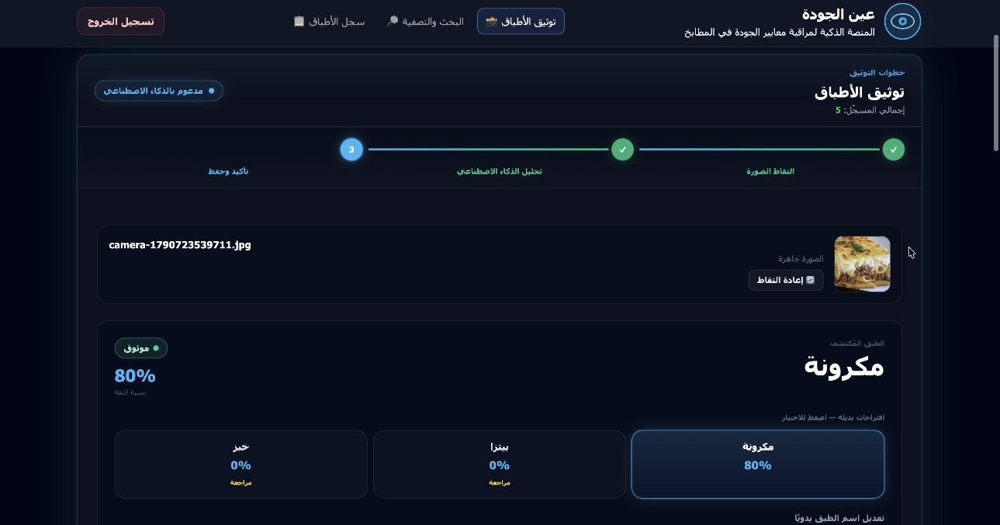
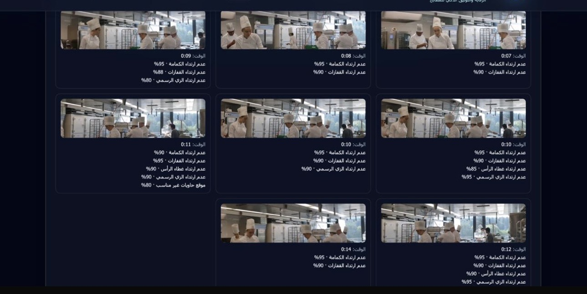

# Screenshots | لقطات الشاشة

A visual overview of **Ayn Al-Jawdah**, showcasing the platform's interface and AI-powered capabilities.

---

## 1. Platform Homepage | الواجهة الرئيسية

The main landing page of Ayn Al-Jawdah, featuring a modern Arabic RTL interface designed for smart kitchen quality monitoring.

---

## 2. AI-Powered Dish Recognition | التعرف الذكي على الأطباق

AI-assisted dish recognition that analyzes captured images, suggests dish names, and displays prediction confidence scores.

---

## 3. AI Video Analysis & Violation Detection | تحليل الفيديو ورصد المخالفات

Computer vision-powered video analysis for identifying kitchen safety and hygiene violations and displaying detected events with confidence scores.

---

> **Note:** Only authentic application screenshots are included. Placeholder images, AI-generated mockups, and fake dashboard data are not presented as actual system results.

---

*Ayn Al-Jawdah Quality Platform | منصة عين الجودة*
