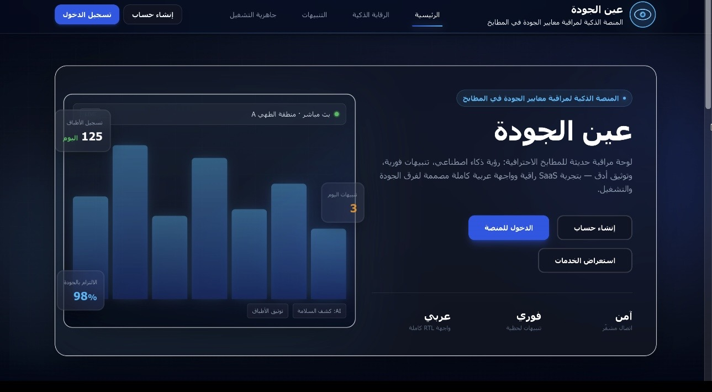

## Screenshots | لقطات الشاشة

A visual overview of Ayn Al-Jawdah, showcasing the platform's interface and AI-powered capabilities.

### 1. Platform Homepage | الواجهة الرئيسية

The main landing page of Ayn Al-Jawdah, featuring a modern Arabic RTL interface designed for smart kitchen quality monitoring.

![Ayn Al-Jawdah Homepage]

---

### 2. AI-Powered Dish Recognition | التعرف الذكي على الأطباق

AI-assisted dish recognition that analyzes captured images, suggests dish names, and displays prediction confidence scores.

---

### 3. AI Video Analysis & Violation Detection | تحليل الفيديو ورصد المخالفات

Computer vision-powered video analysis for identifying potential kitchen safety and hygiene violations, displaying detected events and confidence scores.

---

*Screenshots captured directly from Ayn Al-Jawdah Quality Platform.*
